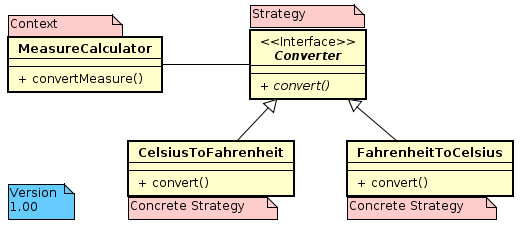
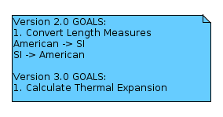

# Strategy

**_Behavioral Gang of Four (GoF) Pattern_**

> 

> **Description**: Guarantee, using a simple structure, the variation of algorithms used in a problem resolution.

> **Applicability**: Use the Strategy pattern when

> *	Many related classes differ only in their behavior. Strategies provide a way to configure a class either one of many behaviors;

> *	You need different variants of an algorithm. Strategies can be used when these variants are implemented as a class hierarchy of algorithms;

> *	An algorithm uses data that clients should not know about. Use the Strategy pattern to avoid exposing complex, algorithm-specific data structures;

> *	A class defines many behaviors, and these appear as multiple conditional statements in its operations. Instead of many conditionals, move related conditional branches into their own Strategy class.

---

## Example Context

> **Short Description**: A system capable to execute typical conversion of American System of Units into SI (International System of Units).

> **Background History**: A engineering student wants a little help at his physics exercises. One of his biggest issues is to convert American units into SI units. The awesome name of the system: **CONVERSIONATOR**.

> ### Version 1.0 (Example)

> **Continuation of the History**: The engineering student is American and lives with a Brazilian exchange student. His roommate, the Brazilian, loves the air conditioner as the warmest possible, at 23°C. The American, otherwise, hates the heat of the Summer and tried to make a deal about the room temperature with his roommate. The Brazilian said: "If you agree, we can keep the room temperature at 12°C and no less than 8°C". The American don't know, yet, if this is a good deal. He wants to use the **CONVERSIONATOR** to convert the two temperatures, in Celsius, into Fahrenheit. Then, knowing the value of the temperature, he wants to use the **CONVERSIONATOR** to convert a Fahrenheit temperature into Celsius, if needed.

> **Features**:

> * Convert a Fahrenheit (American unit) temperature into Celsius (SI derived unit):

>> 

> * Convert a Celsius (SI derived unit) temperature into Fahrenheit (American Unit):

>> 

> ### Version 1.1 (Practice)

> 

> **Continuation of the History**: Since Celsius is not the SI unit of temperature, the engineering student wants to convert Celsius and Fahrenheit into Kelvin, and vice-versa, using the **CONVERSIONATOR**.

> **The Practice**: Using your favorite language, implement the new version of the system. Ensure to keep the use of the Strategy Pattern, you'll see why this pattern is great to systems which evolves continuously.

> **Features**:

> * All Version 1.0 features;

> * Convert a Kelvin (SI unit) temperature into Fahrenheit (American unit):

>> 

> * Convert a Kelvin (SI unit) temperature into Celsius (SI derived unit):

>> Question: Can you use the previous feature to convert Kelvin into Celsius?

> * Convert a Fahrenheit (American unit) temperature into Kelvin (SI unit):

>> 

> * Convert a Celsius (SI derived unit) temperature into Kelvin (SI unit):

>> Question: Can you use the previous feature to convert Celsius into Kelvin?

> **Questions**:

> 1. How can you improve your code?

> 2. How the Strategy Pattern helped you to achieve the features?

> 3. Which other patterns you can use to improve your code?

> ### Versions 2.0 and 3.0 (Challenge)

> 

> **Continuation of the History**: Now is the time to make the **CONVERSIONATOR** shine! The exam of Physics is near and the engineering student wants to use the **CONVERSIONATOR** to discover the Thermal Linear Expansion Coefficient. He needs, first, to convert all kind of length measures.

> **The Challenge**: Using your favorite language, implement the new version of the system. Keep in mind that now you have two types of conversion: Temperature and Length. Furthermore, the new feature, which is not about conversion, will need to use all kinds of length and temperature conversions to discover the Thermal Linear Expansion Coefficient. Use all design patterns you learned!

> **Features**:

> * All version 1.1 features;

> * Convert Between each other: Kilometer, Meter, Centimeter, Millimeter, Inch, Feat, Yard, and Mile. (Version 2.0)

> * Calculate the Thermal Linear Expansion Coefficient (Version 3.0):

>> 

---

## References

> **Strategy Pattern**:

>> https://en.wikipedia.org/wiki/Strategy_pattern

>> https://github.com/iluwatar/java-design-patterns/blob/master/strategy/index.md

> **Physics (Context)**:

>> http://www.ajdesigner.com/phpthermalexpansion/thermal_expansion_equation_linear_length_change.php

>> https://en.wikipedia.org/wiki/International_System_of_Units

>> https://en.wikipedia.org/wiki/United_States_customary_units
